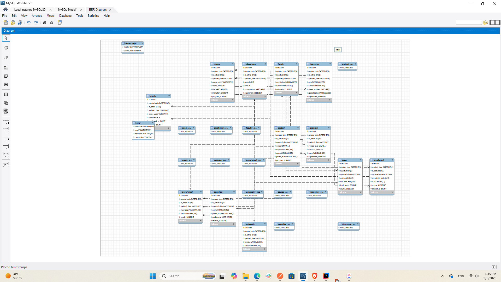

# UniversityERP

UniversityERP is a Spring Boot + MySQL university management system built with JPA/Hibernate. The project manages the main academic structure and operations of a university through REST APIs.

## Main Features

The system includes CRUD operations for:

- University
- Faculty
- Department
- Program
- Course
- Instructor
- Student
- Enrollment
- Exam
- Grade
- Guardian
- Classroom

It also includes:

- DTO-based request and response handling
- Jakarta Bean Validation using `@Valid`
- Global exception handling
- Soft delete using `isActive`
- Active-record filtering
- Student course enrollment
- Duplicate enrollment prevention
- Course capacity validation
- Instructor assignment to courses
- Exam scheduling with future-date validation
- Grade recording and validation
- Student average score and GPA-style classification
- Program and university statistics
- Custom JPA repository queries
- Bonus statistics such as top student per program and instructor credit-hour totals

## Technologies Used

- Java
- Spring Boot
- Spring Web
- Spring Data JPA
- Hibernate
- MySQL
- Jakarta Validation
- Lombok
- Maven
- Postman
- Git / GitHub
- MySQL Workbench

## Project Structure

```text
src/main/java/com/codelegends/UniversityERP/
├── controllers/
├── dto/
├── entities/
├── exceptions/
├── repositories/
└── services/
```

## Database

The application uses MySQL and Hibernate/JPA for persistence. The database tables and relationships are generated from the entity mappings.

### Hibernate-Generated Database Schema

The following schema was generated from the JPA/Hibernate entity mappings and visualized using MySQL Workbench.



## REST API

The main API routes include:

```text
/universities
/faculties
/departments
/programs
/courses
/instructors
/students
/enrollments
/exams
/grades
/guardians
/classrooms
```

Additional business and statistics endpoints are available under:

```text
/business
/stats
```

## Postman Collection

A Postman collection is included in the repository:

```text
postman/UniversityERP.postman_collection.json
```

It can be imported into Postman to test CRUD operations, business operations, statistics, validation, and error cases.

## Running the Project

1. Clone the repository:

```bash
git clone https://github.com/M0hammedAlnajjar/UniversityERP.git
```

2. Open the project in IntelliJ IDEA or another Java IDE.

3. Configure your MySQL connection in `src/main/resources/application.properties`.

4. Start MySQL.

5. Run the Spring Boot application.

Or use Maven Wrapper:

### Windows

```bash
./mvnw.cmd spring-boot:run
```

### macOS / Linux

```bash
./mvnw spring-boot:run
```

By default, the REST API is available at:

```text
http://localhost:8080
```

## Soft Delete

Delete operations use soft deletion instead of permanently removing records. Records are marked inactive using:

```text
isActive = false
```

Normal read operations return active records only.

## Validation and Error Handling

The project uses DTO validation and centralized exception handling. Invalid requests return structured error responses, and missing resources return appropriate HTTP status codes such as `404 Not Found`.

## Debugging Documentation

Development and debugging notes are available in:

```text
DEBUGGING_LOG.md
```

## Build

A GitHub Actions Maven workflow is included under:

```text
.github/workflows/maven-build.yml
```

The workflow compiles and packages the project on pushes and pull requests to the `main` branch.

## Author

**Mohammed Salim Al-Najjar**

University ERP project built as part of Java / Spring Boot backend training.
